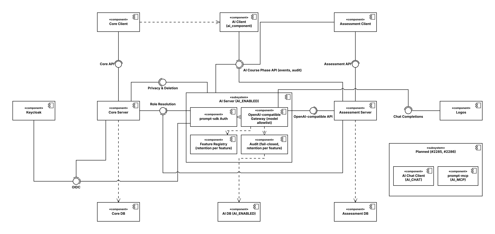

# 🤖 AI Integration

PROMPT reaches language models through one service, the **AI server** (`servers/ai`). It is the only
component that talks to the model provider, Logos. Phase servers call it with the user's Keycloak
token and their own Logos key for the course phase, and it records every call in its own database
before the provider sees it. Its audit records are browsed in their own micro-frontend,
`clients/ai_component`.

Everything AI is behind one switch, `AI_ENABLED`, which is off by default.

## Component Diagram

> The AI server, its database and the AI client run only with `AI_ENABLED=true`. The Assessment
> client and server stand for any phase that uses AI. The planned components are tracked in #2285
> (prompt-mcp) and #2286 (AI chat). The diagram is an [Apollon](https://apollon.aet.cit.tum.de)
> model: import `img/ai-integration/ai-integration.json` there to edit it, then export JSON and SVG
> again.

## Decision Records

1. **Packaging.** A separate service, `servers/ai`, with its own PostgreSQL database. Core stays out
   of the model call path, so a slow or stuck model call cannot starve it. The audit UI is a
   module-federated remote of its own, `clients/ai_component`, and not part of core: it ships and
   is switched off together with the AI server.
2. **Exposure and auth.** The AI server is public under `/ai/api/course_phase/:coursePhaseID` and
   uses the unchanged prompt-sdk `AuthenticationMiddleware` (Keycloak JWKS plus core role
   resolution). The course phase id is part of the URL, the one place the middleware reads it from:
   an OpenAI-compatible body takes no extra fields. Inference and events: PromptAdmin,
   CourseLecturer, CourseEditor. Audit reads: PromptAdmin. No students, and never `PromptLecturer`,
   which the SDK lets pass for every phase (#2288).
3. **Contract.** OpenAI-compatible pass-through: `POST /v1/chat/completions` and `GET /v1/models`
   under the course phase path. PROMPT context goes into headers: `X-Prompt-Provider-Key` and
   `X-Prompt-Feature` are required, `X-Prompt-Template`, `X-Prompt-Template-Version` and
   `X-Prompt-Subjects` optional. The response carries `X-Prompt-AI-Call-ID`. Prompt templates, context aggregation and identifier stripping stay in
   the calling service.
4. **Model access.** Logos only. Each phase server keeps its own Logos key per course phase and
   sends it in `X-Prompt-Provider-Key`; the AI server stores no keys. So every course can use a
   different key, and the AI server is no freely usable endpoint: a call without a phase's key
   never reaches Logos. Assessment is the pilot for a phase-owned key (#2291); a shared key for
   configuration tasks is #2289. `AI_ALLOWED_MODELS` restricts requests to models
   Logos hosts locally, because a Logos key alone does not guarantee local processing. No rate
   limiting or budget logic in the AI server: Logos meters per key.
5. **Streaming.** OpenAI SSE end to end, passed through rather than re-encoded
   (`httputil.ReverseProxy`). Clients use `fetch` plus `eventsource-parser`, because `EventSource`
   cannot send a bearer token. Calls stay inside the user's request; there is no background
   execution.
6. **Audit.** Own database, fail-closed: the record is written before the provider is called.
   Every call names its feature, which sets the content retention from a feature registry in code
   (`<phase type slug>.<feature>`, prefix enforced against the phase's type, which the AI server
   asks core for once per phase). A call without a registered feature is refused, so there is no
   call without a retention. Each record keeps the caller and their role, the `iss` claim of the
   token, the requested and served model and the provider's system fingerprint where it reports
   one. Metadata retention is longer than the longest content retention. Nothing goes to core's
   `audit_log`, and phase servers mark their AI routes with `audit.Skip()`.
7. **Human oversight.** Events API for `shown`, `accepted`, `edited` (edit distance) and
   `rejected`, reported by the user who made the call. Audit reads are admin-only, under the course
   phase routes, and every content read is itself recorded. The admin page per course lives in the
   `ai_component` micro-frontend, which lists the calls one phase at a time.
8. **Privacy.** Core asks the AI server as a standalone module (`servers/core/standaloneModule`,
   a service that is not a phase type but keeps data per person) in the privacy export and
   per-student deletion fan-outs when AI is enabled. It keeps no data per course phase, so phase
   deletion does not ask it. High-risk content under erasure is access-restricted until its
   retention ends (GDPR Art. 17(3)(b)); other content is deleted immediately. Students are informed through the privacy policy (AI Act Art. 26(11));
   lecturer-facing output is labeled AI-generated (Art. 50(1)).
9. **Switch and failure behavior.** One GitHub variable, `AI_ENABLED`, off by default. The
   deployment derives the compose profile `ai` from it (AI server, its database and the AI
   client), and it is passed to core and to the phase servers that use AI. Core loads the AI
   remote only while the AI server answers healthy on `/ai/api/info`. Disabled, unreachable or
   unconfigured all mean the AI surfaces are hidden and the workflow is untouched. The chat and MCP
   components get switches of their own, `AI_CHAT` and `AI_MCP`, on top of `AI_ENABLED`, so no
   dead AI functionality ships.
10. **Regulatory stance.** Treated as high-risk under the EU AI Act (Annex III 3(b), steering the
    learning process; the Art. 6(3) exemption does not apply because condensing feedback about one
    student is profiling). Logging per Art. 12, retention of at least six months per Art. 19 and
    26(6) for high-risk features. The high-risk obligations apply from 2 December 2027.
11. **Testing.** aimock (`ghcr.io/copilotkit/aimock`) as the stub provider in the Go tests
    (testcontainers) and in the `ai` e2e shard, with shared fixtures under `e2e/fixtures/aimock`.
12. **Evaluation study data.** The study gets only an anonymized aggregate (counts, acceptance and
    edit-distance distributions, latency per feature and template version), produced by a
    documented SQL script run by an admin. Raw audit data never leaves production.

## Calling the AI Server

A stock OpenAI SDK works against the AI server: set `baseURL` to
`<host>/ai/api/course_phase/<coursePhaseID>/v1`, pass the user's Keycloak token as the API key and
the phase's Logos key and the feature as default headers (`X-Prompt-Provider-Key`,
`X-Prompt-Feature`).

| Route | Roles | Purpose |
| --- | --- | --- |
| `POST /v1/chat/completions` | PromptAdmin, CourseLecturer, CourseEditor | Streamed or plain completion |
| `GET /v1/models` | PromptAdmin, CourseLecturer, CourseEditor | Models both allowed and available to the key sent along |
| `POST /calls/:callID/events` | PromptAdmin, CourseLecturer, CourseEditor | Oversight events, on the caller's own calls (any call for PromptAdmin) |
| `GET /calls`, `GET /calls/:callID` | PromptAdmin | Audit metadata, and one call's content |

The gateway forwards the body unchanged, except that the `model` must be in `AI_ALLOWED_MODELS`,
`user` is removed so no identifier reaches the provider, and streams always end with a usage
chunk. Only the phase's key goes to the provider, never the caller's token or the `X-Prompt-*`
headers. A call without a key or without a registered feature of the phase's type answers `400`
and is recorded as denied. If the call cannot be recorded, the
answer is `503` and the provider is never called. Requests over 4 MiB are refused; a call ends
after 10 minutes, or after 2 minutes without a chunk.

`X-Prompt-Subjects` takes at most 100 course participation ids. They are recorded as given, so the
calling service is responsible for naming the right students.

A feature is named `<phase type slug>.<feature>`, for example `assessment.action_item_suggestions`.
The slug is the phase type name in kebab case. A new feature, or a different retention, is a change
to `servers/ai/feature/registry.go`.

| Feature | Content retention | High-risk |
| --- | --- | --- |
| `assessment.*` | 730 days | yes |

## Audit Records

| Table | Contents | Retention |
| --- | --- | --- |
| `ai_call` | Who (Keycloak `sub` and role, no name), the token's issuer, phase, feature, template, requested and served model, system fingerprint, parameters, hashes of request and response, outcome, status, finish reason, tokens, timings | `AI_AUDIT_METADATA_RETENTION_DAYS` (default 1825) |
| `ai_call_content` | Request and response as passed through, AES-GCM encrypted; a cancelled stream keeps its partial response | per feature |
| `ai_call_subject` | The course participations named in `X-Prompt-Subjects` | per feature |
| `ai_call_content_restriction` | Content kept but restricted after an erasure request | per feature |
| `ai_call_event` | `shown`, `accepted`, `edited`, `rejected`, `content_viewed` | metadata retention |

Triggers keep the audit tables append-only: the only update completes a pending call once. A daily
purge, which also runs at startup, deletes content and subjects per feature and then metadata, and
closes calls left pending by a restart. The AI server refuses to start unless the metadata
retention is longer than the longest content retention.

## Privacy

- **Export:** the calls a person made, and the calls they were a subject of, with their events.
  Content is included only while it is retained and not restricted, and only to the call's sole
  subject: content that also concerns other people is withheld (GDPR Art. 15(4)). The other
  party's identity is left out.
- **Erasure:** applies to the calls the person was a subject of. High-risk content is restricted
  until its retention ends, other content and the person's subject link are deleted at once. The
  metadata of calls the person made stays as logging evidence.
- **Phase and course deletion:** nothing to delete in the AI server; the audit records stay until
  their retention ends. The phase server deletes its key with the phase.

Core asks the AI server like a phase module in the privacy fan-outs: if it is unreachable, the
privacy request reports the AI part as failed.

## Configuration

| Variable | Purpose |
| --- | --- |
| `AI_ENABLED` | The switch. The Makefile and the deployment derive `COMPOSE_PROFILES=ai` from it |
| `AI_PROVIDER_BASE_URL` | OpenAI-compatible base URL of Logos, including `/v1` |
| `AI_ALLOWED_MODELS` | Comma-separated models Logos hosts locally |
| `AI_ENCRYPTION_KEY` | Base64-encoded 32-byte key for the stored content, `openssl rand -base64 32` |
| `AI_AUDIT_METADATA_RETENTION_DAYS` | Call metadata retention in days |
| `AI_HOST` | Where the core client and the AI client reach the AI server; the core host in production |

In production Traefik routes `/ai/api` to the AI server with the API rate limit and without the
compress middleware, which would buffer streamed completions, and `/ai` to the AI client. Locally,
set `AI_ENABLED=true` and `AI_ALLOWED_MODELS` in `.env`: `make db` then starts the AI database,
`make server-ai` the server on port 8092 and `make client-ai` the AI client on port 3013. The e2e
shard `ai` runs the stack with the AI server, the AI client and aimock as the provider.

## Open Items

- A data protection impact assessment (GDPR Art. 35).
- With the data protection officer (#2290): what happens to AI data while `AI_ENABLED=false` (the
  database is stopped, so no purge, export or erasure reaches it); how GDPR erasure weighs against
  the AI Act's logging duties; restricting instead of deleting high-risk content during its
  retention; a pseudonymized study export, only if the aggregate is not enough.
- Follow-ups: prompt-mcp (#2285), the AI chat (#2286), a shared key for configuration tasks
  (#2289), the role model and per-request role lookups (#2288), and the assessment key pilot
  (#2291).
